Early and accurate diagnosis of multiple dental conditions and oral cancer remains a critical unmet need in clinical practice, where traditional visual and radiographic examinations are subjective and siloed by disease type. This study introduces MultiDentNet, a unified deep learning framework designed to automatically classify five common dental conditions caries, gingivitis, tooth discoloration, ulcers, and Hypodontia as well as oral cancer from intraoral images. To the best of our knowledge, this is the first comprehensive study to classify all five dental conditions simultaneously alongside oral cancer on these datasets; previous efforts have addressed at most one or two classes. To address the gap in multi-condition diagnostic tools, we augment a DenseNet-121 backbone with hierarchical self-attention modules that capture both local lesion details and global context. Evaluated on a curated dataset of 6,791 training, 1,701 validation, and 947 test images for dental conditions, and an additional dataset of 940 images for oral cancer (490 cancer and 450 non-cancer), MultiDentNet achieves 99.37\% overall accuracy, 99.37\% precision, 99.37\% recall, an F1-Score of 0.98, AUC of 1.00, and a log loss of 0.023 for dental conditions. For oral cancer, the model achieves 94.68\% accuracy, 97.62\% precision, 91.11\% recall, and an F1-Score of 0.94. The model maintains particularly strong performance on underrepresented classes, achieving an F1-score of 0.94 for Hypodontia and 0.95 for oral cancer. Interpretability analyses, including t-SNE feature clustering, one-vs-rest ROC and precision-recall curves, and confusion matrix visualizations, demonstrate distinct class separation and minimal misclassification, highlighting both robustness and clinical relevance. By integrating advanced attention mechanisms, class-aware loss functions, and rigorous interpretability tools, this work delivers a novel, scalable, and clinically applicable AI solution for comprehensive dental and oral cancer diagnostics, setting the stage for real-world decision support systems and future extensions to broader oral health conditions.

The datasets can be downloaded from this Kaggle address: https://www.kaggle.com/datasets/salmansajid05/oral-diseases, https://www.kaggle.com/datasets/zaidpy/new-oral-cancer/data.

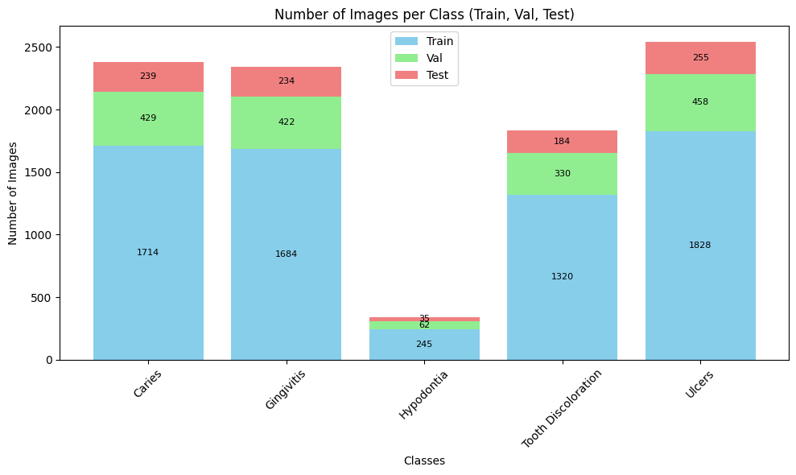
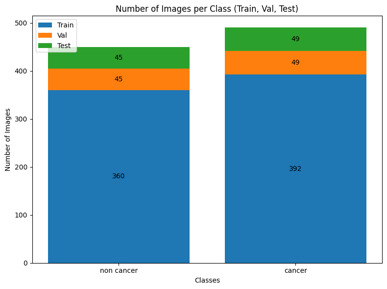

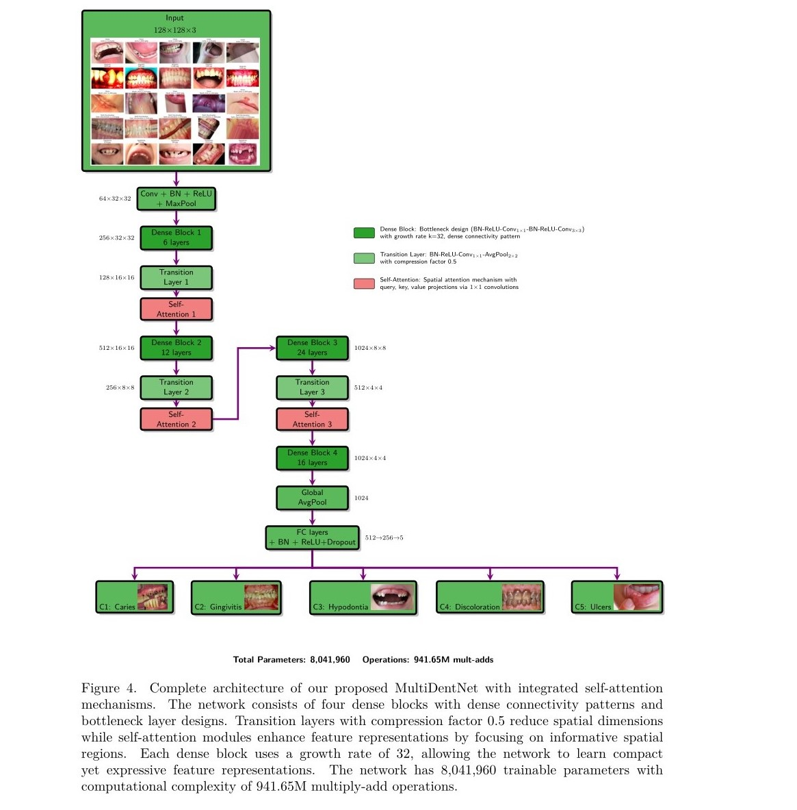

### Evaluation Summary  

| Metric          | Value   |
|-----------------|---------|
| Accuracy        | 0.9937  |
| Precision       | 0.9937  |
| Recall          | 0.9937  |
| F1-Score        | 0.9936  |
| Cohen's Kappa   | 0.9917  |
| MCC             | 0.9917  |
| Log Loss        | 0.0230  |

### Classification Report

| Category              | Precision | Recall | F1-Score | Support |
|-----------------------|-----------|--------|----------|---------|
| Caries                | 1.00      | 1.00   | 1.00     | 239     |
| Gingivitis            | 0.98      | 1.00   | 0.99     | 234     |
| Hypodontia            | 0.97      | 0.91   | 0.94     | 35      |
| Tooth Discoloration   | 1.00      | 0.99   | 0.99     | 184     |
| Ulcers                | 1.00      | 1.00   | 1.00     | 255     |

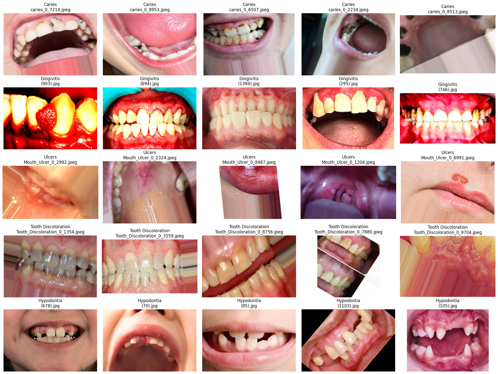
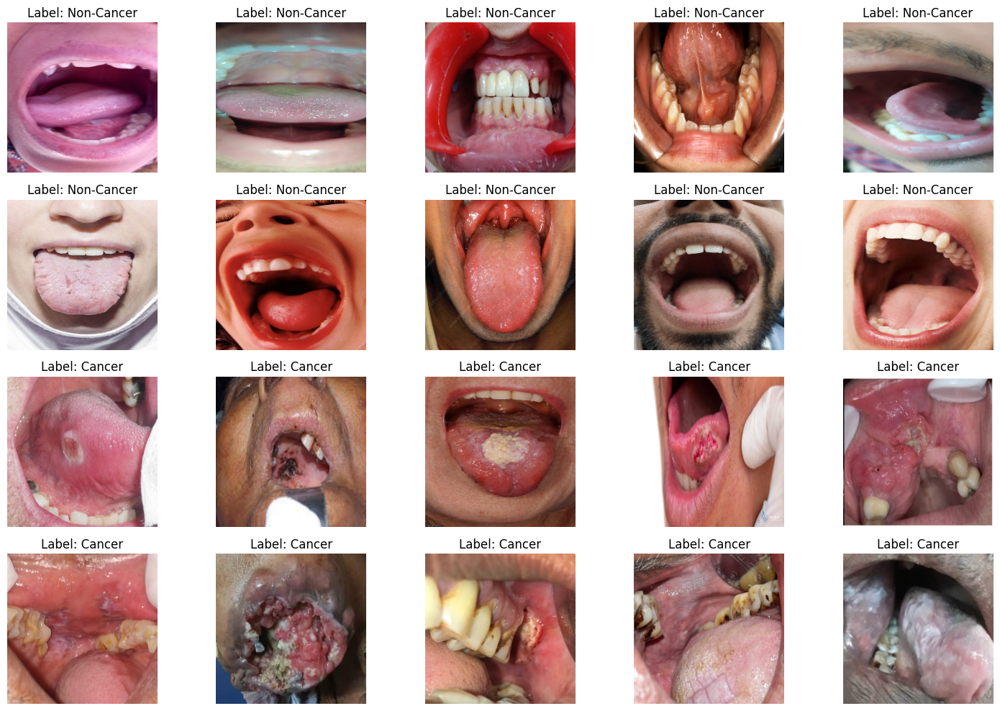

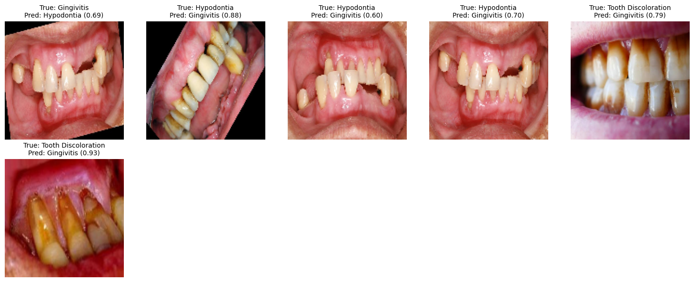
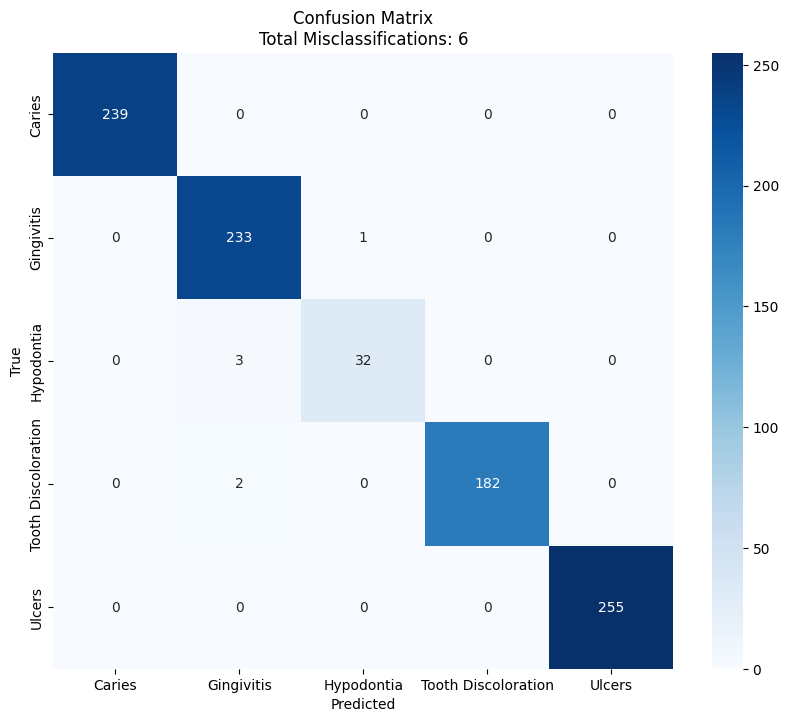
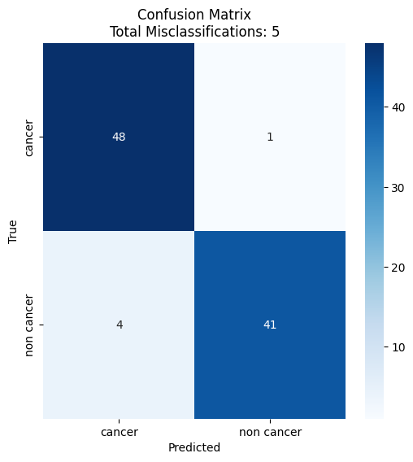

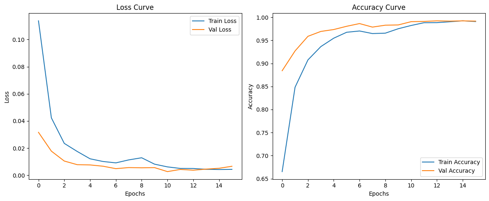
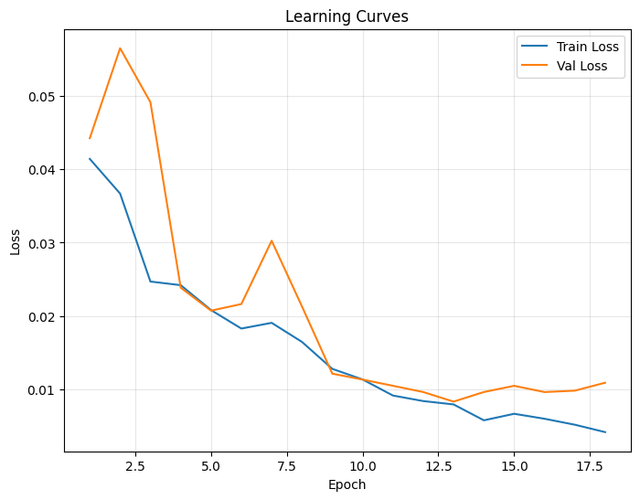
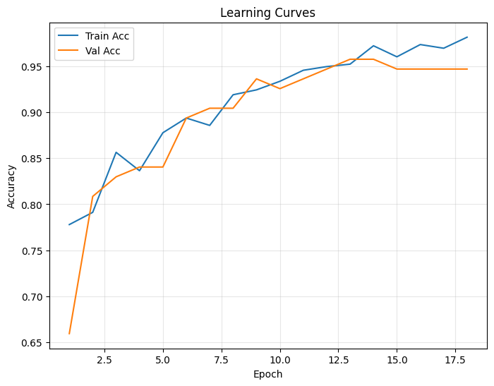

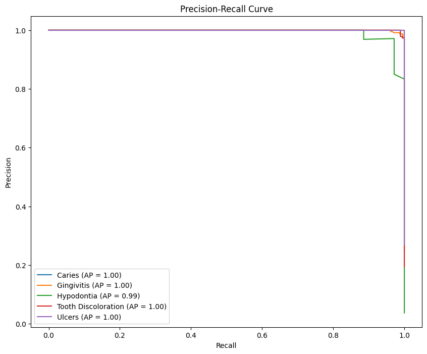
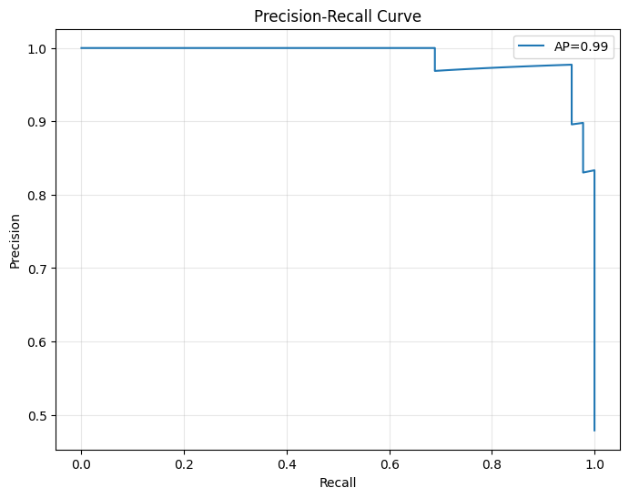

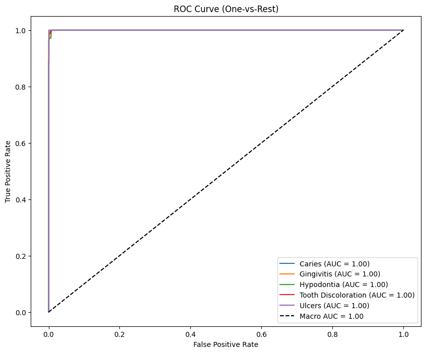
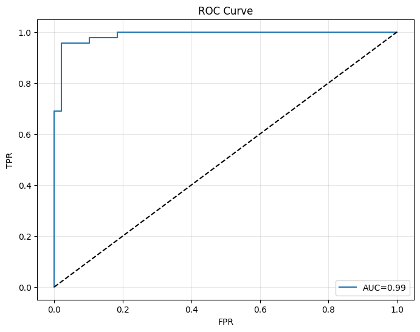
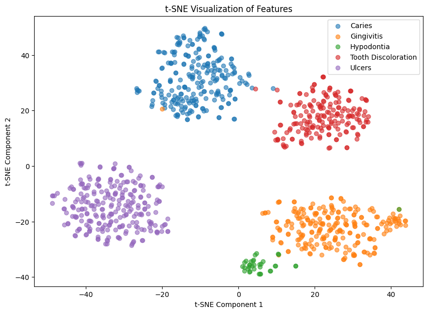
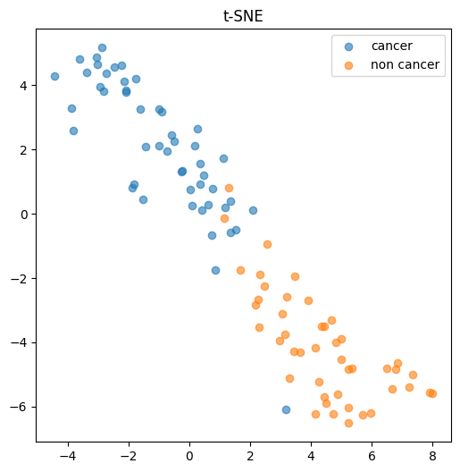

