# MultiDentNet: A Unified Deep Learning Framework for Automated Screening of Dental Conditions and Proof-of-Concept Oral Cancer Detection

## Overview

# Objectives: 
This study introduces MultiDentNet, a unified deep learning framework for automated screening of multiple dental conditions and oral cancer. The framework addresses limitations of manual examinations and single-condition models by leveraging architectural diversity and inter-class dependency modeling to improve diagnostic accuracy and generalizability.
# Materials and Methods:
MultiDentNet integrates four pre-trained convolutional neural networks (DenseNet121, EfficientNetV2-S, ResNet50, Inception-V3), enhanced with squeeze-and-excitation (SE) blocks, graph convolutional networks (GCNs) with learnable adjacency matrices, and a multi-task learning strategy. Predictions are combined via a weighted ensemble optimized on validation performance. The framework was evaluated on a dental dataset (9,439 images across five conditions) and a separate oral cancer subset (940 images). Given its limited size, single-center origin, and absence of histopathological confirmation, the oral cancer analysis is presented strictly as a proof-of-concept. Performance was assessed using accuracy, Cohen’s $\kappa$, false-negative rate (FNR), interpretability (Grad-CAM, t-SNE), and ablation studies.

# Results:
MultiDentNet achieved 99.68\% accuracy for dental conditions and 98.53\% for oral cancer, outperforming individual backbones and prior benchmarks. Inter-rater agreement was near-perfect (Cohen’s $\kappa$ = 1.00 for dental conditions, 0.97 for oral cancer), with a malignant lesion FNR of 2.4\%. Ablation studies confirmed the benefit of SE blocks, GCNs, and multi-task learning. Visualizations highlighted clinically relevant regions, while rare classes such as hypodontia remained more challenging (FNR: 8.57\%). Oral cancer results, though promising, are clearly not yet clinically generalizable.

# Conclusions:
By combining diverse CNN architectures with adaptive dependency modeling, MultiDentNet delivers accurate and interpretable multi-condition screening for dental pathologies. It reduces diagnostic errors, supports early detection, and accelerates workflows in simulated clinical settings. Future work should emphasize external validation using multi-center, histopathologically confirmed datasets and multimodal integration (e.g., radiographic and clinical data). The code and supplementary results are available at \url{https://github.com/Aliyar4061/MultiDentNet}.

# Clinical Relevance:
MultiDentNet demonstrates potential as a scalable AI-assisted screening tool for dental and oral lesion assessment. Its applications include (i) triage in rural or underserved areas, (ii) supporting general practitioners and hygienists in preliminary evaluations, (iii) streamlining high-volume clinic workflows, and (iv) integration into tele-dentistry and mobile health platforms. The lightweight design enables real-time inference on mobile devices and seamless interfacing with cloud-based electronic health record systems, enhancing continuity of care.


## Features

- **Comprehensive Classification:** Simultaneously detects five dental conditions and oral cancer in a unified model.
- **High Performance:** Achieves 99.37% accuracy on dental conditions and 94.68% on oral cancer datasets.
- **Interpretability:** Includes t-SNE visualizations, ROC/PR curves, and confusion matrices for transparent decision-making.
- **Robust Training:** Incorporates Focal Loss, mixed-precision training, and domain-specific augmentations for handling imbalanced data.

## Dataset

- **Dental Condition Dataset:** Contains 9,439 annotated intraoral images, split into 6,791 training, 1,701 validation, and 947 test samples. Available at [Kaggle](https://www.kaggle.com/datasets/salmansajid05/oral-diseases).
- **Oral Cancer Dataset:** Comprises 940 images (490 cancer, 450 non-cancer), split into 752 training, 94 validation, and 94 test samples. Available at [Kaggle](https://www.kaggle.com/datasets/shivan17299/oral-cancer-lips-and-tongue-images).
- **Augmentation:** Utilizes CLAHE, elastic deformations, and rotations to enhance diversity and generalization.

## Installation

1. **Clone the Repository:**
   ```bash
   git clone https://github.com/yourusername/MultiDentNet.git
   cd MultiDentNet


torch==2.1.0

 torchvision==0.16.0  # Compatible with torch 2.1.0
 
 albumentations==1.3.1
 
 numpy==1.24.4
 
 matplotlib==3.7.4
 
 seaborn==0.13.0
 
 scikit-learn==1.3.2
 
 pillow==10.1.0

The datasets can be downloaded from this Kaggle address: https://www.kaggle.com/datasets/salmansajid05/oral-diseases, https://www.kaggle.com/datasets/zaidpy/new-oral-cancer/data.


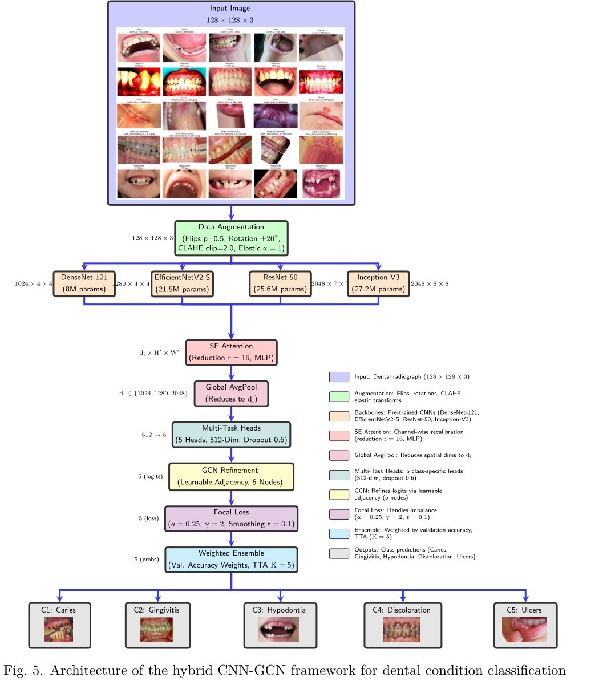

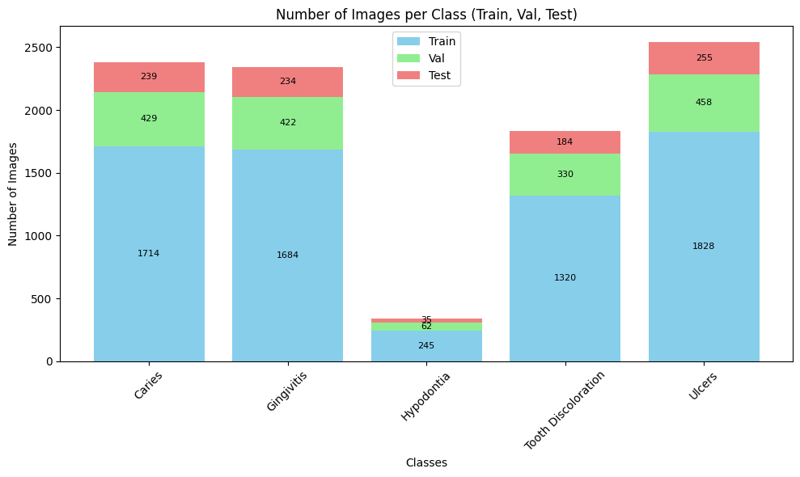
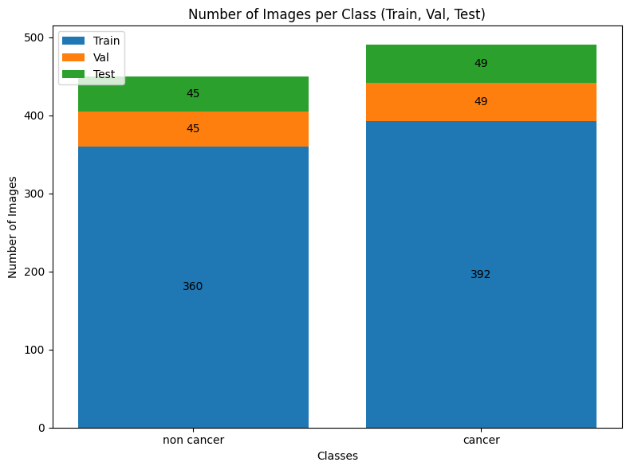


| **Component**         | **Parameter**               | **Value**                   |
| --------------------- | --------------------------- | --------------------------- |
| **Training**          | Initial learning rate       | 5 × 10⁻⁴                    |
|                       | Weight decay                | 1 × 10⁻⁴                    |
|                       | Batch size                  | 32                          |
|                       | Maximum epochs              | 50                          |
|                       | Early stopping patience     | 5                           |
| **Optimizer**         | AdamW β₁                    | 0.9                         |
|                       | AdamW β₂                    | 0.999                       |
|                       | Minimum learning rate       | 1 × 10⁻⁶                    |
|                       | Cosine annealing T          | 50                          |
| **Focal Loss**        | Alpha (α)                   | 0.25                        |
|                       | Gamma (γ)                   | 2.0                         |
|                       | Label smoothing (ε)         | 0.1                         |
| **SE Block**          | Reduction ratio (r)         | 16                          |
|                       | Activations                 | ReLU + Sigmoid              |
| **Multi-Task**        | Hidden dimension            | 512                         |
|                       | Dropout Rate                | 0.6                         |
| **Data Augmentation** | Input resolution            | 128 × 128                   |
|                       | Flip probability            | 0.5                         |
|                       | Rotation limit              | ±20° (p=0.7)                |
|                       | Color jitter parameters     | 0.1 (p=0.5)                 |
|                       | Coarse dropout max holes    | 8 (p=0.5)                   |
|                       | CLAHE clip limit            | 2.0 (p=0.3)                 |
|                       | Elastic transform           | α=1, σ=50 (p=0.3)           |
| **TTA**               | Number of augmentations (K) | 5                           |
|                       | Transformations             | Flips (p=0.5), ±15° (p=0.5) |
| **GCN**               | Number of classes (C)       | 5                           |
|                       | Adjacency epsilon (ε)       | 1 × 10⁻⁹                    |

| **Model**                         | **Weight** |
| --------------------------------- | ---------- |
| densenet121_no_gcn                | 0.2010     |
| tf_efficientnetv2_s_no_mt         | 0.2003     |
| resnet50_no_gcn                   | 0.2004     |
| inception_v3_no_mt                | 0.1981     |
| tf_efficientnetv2_s_learnable_adj | 0.2003     |

| **Class**           | **FNR** |
| ------------------- | ------- |
| Caries              | 0.0000  |
| Gingivitis          | 0.0000  |
| Hypodontia          | 0.0857  |
| Tooth Discoloration | 0.0000  |
| Ulcers              | 0.0000  |


| **Class**           | **Precision** | **Recall** | **F1-Score** | **Support** |
| ------------------- | ------------- | ---------- | ------------ | ----------- |
| Caries              | 1.0000        | 1.0000     | 1.0000       | 239         |
| Gingivitis          | 0.9873        | 1.0000     | 0.9936       | 234         |
| Hypodontia          | 1.0000        | 0.9143     | 0.9552       | 35          |
| Tooth Discoloration | 1.0000        | 1.0000     | 1.0000       | 184         |
| Ulcers              | 1.0000        | 1.0000     | 1.0000       | 255         |
| **Accuracy**        | –             | –          | 0.9968       | 947         |
| **Macro Avg**       | 0.9975        | 0.9829     | 0.9898       | 947         |
| **Weighted Avg**    | 0.9969        | 0.9968     | 0.9968       | 947         |

| **Model**                         | **Weight** |
| --------------------------------- | ---------- |
| densenet121_learnable_adj         | 0.2012     |
| tf_efficientnetv2_s_no_se         | 0.2000     |
| resnet50                          | 0.2000     |
| inception_v3_learnable_adj        | 0.2012     |
| tf_efficientnetv2_s_learnable_adj | 0.1976     |

| **Class**              | **FNR** |
| ---------------------- | ------- |
| Oral lesions benign    | 0.0057  |
| Oral lesions malignant | 0.0240  |

| **Class**              | **Precision** | **Recall** | **F1-Score** | **Support** |
| ---------------------- | ------------- | ---------- | ------------ | ----------- |
| Oral lesions benign    | 0.9774        | 0.9943     | 0.9858       | 174         |
| Oral lesions malignant | 0.9939        | 0.9760     | 0.9849       | 167         |
| **Accuracy**           | –             | –          | 0.9853       | 341         |
| **Macro Avg**          | 0.9857        | 0.9852     | 0.9853       | 341         |
| **Weighted Avg**       | 0.9855        | 0.9853     | 0.9853       | 341         |


### Table 1: Backbone architectures and their implementation names

| **Backbone architecture** | **Implementation name** |
| :------------------------ | :---------------------- |
| DenseNet-121              | `densenet121`           |
| EfficientNetV2-S          | `tf_efficientnetv2_s`   |
| ResNet50                  | `resnet50`              |
| Inception-V3              | `inception_v3`          |

### Table 2: Training and validation performance with runtime for dental dataset

| Model | Train Loss | Val Loss | Train Acc (%) | Val Acc (%) | Avg Runtime (s) |
| :---- | :--------- | :------- | :------------ | :---------- | :-------------- |
| **densenet121** | 0.00 | 0.00 | 98.00 | 98.77 | 45.30 |
| **densenet121_no_se** | 0.00 | 0.00 | 97.10 | 99.29 | 44.91 |
| **densenet121_no_gcn** | 0.00 | 0.00 | 99.62 | 99.12 | 44.95 |
| **densenet121_no_mt** | 0.00 | 0.00 | 98.90 | 99.06 | 43.83 |
| **tf_efficientnetv2_s** | 0.00 | 0.00 | 98.28 | 98.53 | 46.44 |
| **tf_efficientnetv2_s_no_se** | 0.00 | 0.00 | 98.19 | 98.30 | 47.15 |
| **tf_efficientnetv2_s_no_gcn** | 0.00 | 0.00 | 98.73 | 98.41 | 47.65 |
| **tf_efficientnetv2_s_no_mt** | 0.00 | 0.00 | 98.56 | 99.18 | 47.05 |
| **resnet50** | 0.00 | 0.00 | 98.78 | 99.00 | 38.27 |
| **resnet50_no_se** | 0.00 | 0.00 | 99.01 | 98.82 | 37.97 |
| **resnet50_no_gcn** | 0.00 | 0.00 | 99.29 | 98.94 | 38.51 |
| **resnet50_no_mt** | 0.00 | 0.00 | 98.93 | 98.82 | 37.77 |
| **inception_v3** | 0.00 | 0.00 | 97.72 | 96.59 | 42.34 |
| **inception_v3_no_se** | 0.00 | 0.00 | 95.74 | 97.24 | 41.85 |
| **inception_v3_no_gcn** | 0.00 | 0.01 | 97.17 | 96.30 | 42.04 |
| **inception_v3_no_mt** | 0.00 | 0.00 | 98.13 | 97.94 | 41.32 |
| **densenet121_learnable_adj** | 0.00 | 0.00 | 99.81 | 99.35 | 45.12 |
| **tf_efficientnetv2_s_learnable_adj** | 0.00 | 0.00 | 98.28 | 98.06 | 47.84 |
| **resnet50_learnable_adj** | 0.00 | 0.00 | 98.85 | 98.53 | 40.43 |
| **inception_v3_learnable_adj** | 0.02 | 0.11 | 78.41 | 75.84 | 44.00 |
| **Backbone Diverse Ensemble** | 0.01 | 0.01 | 99.84 | 99.53 | - |

### Table 3: Test set performance metrics (with TTA) for dental dataset

| Model | Loss | Accuracy (%) | Bal Acc (%) | Precision (%) | Recall (%) | F1-Score (%) | Specificity (%) | Cohen’s κ | MCC | Log Loss | Brier | AUC |
| :---- | :--- | :----------- | :---------- | :------------ | :--------- | :----------- | :-------------- | :-------- | :--- | :------- | :---- | :--- |
| **densenet121** | 0.01 | 99.05 | 97.73 | 99.05 | 99.05 | 99.05 | 99.76 | 0.99 | 0.99 | 0.06 | 0.00 | 1.00 |
| **densenet121_no_se** | 0.01 | 99.58 | 98.20 | 99.57 | 99.58 | 99.57 | 99.89 | 0.99 | 0.99 | 0.03 | 0.00 | 1.00 |
| **densenet121_no_gcn** | 0.01 | 99.58 | 98.18 | 99.58 | 99.58 | 99.57 | 99.89 | 0.99 | 0.99 | 0.02 | 0.00 | 1.00 |
| **densenet121_no_mt** | 0.01 | 99.26 | 97.90 | 99.26 | 99.26 | 99.26 | 99.81 | 0.99 | 0.99 | 0.03 | 0.00 | 1.00 |
| **tf_efficientnetv2_s** | 0.01 | 99.37 | 98.01 | 99.37 | 99.37 | 99.36 | 99.84 | 0.99 | 0.99 | 0.04 | 0.00 | 1.00 |
| **tf_efficientnetv2_s_no_se** | 0.01 | 99.05 | 96.76 | 99.06 | 99.05 | 99.03 | 99.75 | 0.99 | 0.99 | 0.05 | 0.00 | 1.00 |
| **tf_efficientnetv2_s_no_gcn** | 0.01 | 98.73 | 97.86 | 98.77 | 98.73 | 98.74 | 99.69 | 0.98 | 0.98 | 0.04 | 0.00 | 1.00 |
| **tf_efficientnetv2_s_no_mt** | 0.01 | 99.26 | 97.92 | 99.26 | 99.26 | 99.26 | 99.82 | 0.99 | 0.99 | 0.04 | 0.00 | 1.00 |
| **resnet50** | 0.01 | 99.47 | 98.61 | 99.47 | 99.47 | 99.47 | 99.87 | 0.99 | 0.99 | 0.02 | 0.00 | 1.00 |
| **resnet50_no_se** | 0.01 | 99.47 | 98.60 | 99.47 | 99.47 | 99.47 | 99.87 | 0.99 | 0.99 | 0.03 | 0.00 | 1.00 |
| **resnet50_no_gcn** | 0.01 | 99.26 | 98.85 | 99.26 | 99.26 | 99.26 | 99.81 | 0.99 | 0.99 | 0.03 | 0.00 | 1.00 |
| **resnet50_no_mt** | 0.01 | 99.58 | 98.18 | 99.58 | 99.58 | 99.57 | 99.89 | 0.99 | 0.99 | 0.03 | 0.00 | 1.00 |
| **inception_v3** | 0.01 | 99.37 | 99.01 | 99.38 | 99.37 | 99.37 | 99.85 | 0.99 | 0.99 | 0.05 | 0.00 | 1.00 |
| **inception_v3_no_se** | 0.01 | 98.52 | 97.33 | 98.54 | 98.52 | 98.52 | 99.63 | 0.98 | 0.98 | 0.08 | 0.01 | 1.00 |
| **inception_v3_no_gcn** | 0.01 | 97.25 | 95.32 | 97.31 | 97.25 | 97.25 | 99.29 | 0.96 | 0.96 | 0.09 | 0.01 | 1.00 |
| **inception_v3_no_mt** | 0.01 | 99.05 | 97.69 | 99.07 | 99.05 | 99.04 | 99.75 | 0.99 | 0.99 | 0.06 | 0.00 | 1.00 |
| **densenet121_learnable_adj** | 0.01 | 99.58 | 98.20 | 99.57 | 99.58 | 99.57 | 99.89 | 0.99 | 0.99 | 0.02 | 0.00 | 1.00 |
| **tf_efficientnetv2_s_learnable_adj** | 0.01 | 99.05 | 96.71 | 99.07 | 99.05 | 99.03 | 99.75 | 0.99 | 0.99 | 0.05 | 0.00 | 1.00 |
| **resnet50_learnable_adj** | 0.01 | 99.26 | 97.85 | 99.27 | 99.26 | 99.25 | 99.80 | 0.99 | 0.99 | 0.04 | 0.00 | 1.00 |
| **inception_v3_learnable_adj** | 0.02 | 87.43 | 78.28 | 87.37 | 87.43 | 87.01 | 96.72 | 0.83 | 0.83 | 0.42 | 0.04 | 0.98 |
| **Backbone Diverse Ensemble** | 0.01 | 99.68 | 98.29 | 99.69 | 99.68 | 99.68 | 99.92 | 1.00 | 1.00 | 0.03 | 0.00 | 1.00 |

### Table 4: Training and validation performance with runtime for oral cancer

| Model | Train Loss | Val Loss | Train Acc (%) | Val Acc (%) | Avg Runtime (s) |
| :---- | :--------- | :------- | :------------ | :---------- | :-------------- |
| **densenet121** | 0.00 | 0.00 | 99.94 | 98.82 | 24.59 |
| **densenet121_no_se** | 0.00 | 0.01 | 98.99 | 98.82 | 23.84 |
| **densenet121_no_gcn** | 0.00 | 0.00 | 99.69 | 99.12 | 23.67 |
| **densenet121_no_mt** | 0.00 | 0.01 | 99.18 | 98.24 | 23.79 |
| **tf_efficientnetv2_s** | 0.00 | 0.00 | 99.87 | 98.82 | 26.49 |
| **tf_efficientnetv2_s_no_se** | 0.00 | 0.00 | 99.81 | 99.12 | 25.00 |
| **tf_efficientnetv2_s_no_gcn** | 0.00 | 0.00 | 99.62 | 98.53 | 25.11 |
| **tf_efficientnetv2_s_no_mt** | 0.00 | 0.00 | 99.69 | 98.82 | 24.78 |
| **resnet50** | 0.00 | 0.00 | 99.12 | 99.41 | 23.21 |
| **resnet50_no_se** | 0.00 | 0.00 | 98.93 | 97.94 | 22.75 |
| **resnet50_no_gcn** | 0.00 | 0.00 | 99.62 | 98.53 | 23.08 |
| **resnet50_no_mt** | 0.01 | 0.00 | 98.87 | 99.12 | 23.26 |
| **inception_v3** | 0.01 | 0.01 | 95.28 | 94.71 | 21.86 |
| **inception_v3_no_se** | 0.00 | 0.00 | 98.93 | 98.82 | 21.76 |
| **inception_v3_no_gcn** | 0.00 | 0.00 | 99.62 | 99.41 | 21.38 |
| **inception_v3_no_mt** | 0.00 | 0.00 | 98.74 | 98.82 | 21.89 |
| **densenet121_learnable_adj** | 0.00 | 0.00 | 99.56 | 99.12 | 23.76 |
| **tf_efficientnetv2_s_learnable_adj** | 0.00 | 0.00 | 99.50 | 98.24 | 24.85 |
| **resnet50_learnable_adj** | 0.00 | 0.00 | 98.68 | 98.82 | 22.93 |
| **inception_v3_learnable_adj** | 0.00 | 0.00 | 99.37 | 99.12 | 21.84 |
| **Backbone Diverse Ensemble** | 0.02 | 0.02 | 100.00 | 99.12 | - |

### Table 5: Test set performance metrics (with TTA) for oral cancer

| Model | Loss | Accuracy (%) | Bal Acc (%) | Precision (%) | Recall (%) | F1-Score (%) | Specificity (%) | Cohen’s κ | MCC | Log Loss | Brier | AUC |
| :---- | :--- | :----------- | :---------- | :------------ | :--------- | :----------- | :-------------- | :-------- | :--- | :------- | :---- | :--- |
| **densenet121** | 0.03 | 97.95 | 97.92 | 97.99 | 97.95 | 97.95 | 97.92 | 0.96 | 0.96 | 0.05 | 0.01 | 1.00 |
| **densenet121_no_se** | 0.03 | 97.65 | 97.62 | 97.71 | 97.65 | 97.65 | 97.62 | 0.95 | 0.95 | 0.07 | 0.02 | 1.00 |
| **densenet121_no_gcn** | 0.03 | 97.36 | 97.32 | 97.44 | 97.36 | 97.36 | 97.32 | 0.95 | 0.95 | 0.07 | 0.02 | 1.00 |
| **densenet121_no_mt** | 0.03 | 98.24 | 98.22 | 98.27 | 98.24 | 98.24 | 98.22 | 0.96 | 0.97 | 0.06 | 0.01 | 1.00 |
| **tf_efficientnetv2_s** | 0.03 | 97.65 | 97.62 | 97.71 | 97.65 | 97.65 | 97.62 | 0.95 | 0.95 | 0.07 | 0.02 | 1.00 |
| **tf_efficientnetv2_s_no_se** | 0.03 | 97.36 | 97.32 | 97.44 | 97.36 | 97.36 | 97.32 | 0.95 | 0.95 | 0.05 | 0.02 | 1.00 |
| **tf_efficientnetv2_s_no_gcn** | 0.03 | 97.95 | 97.92 | 97.99 | 97.95 | 97.95 | 97.92 | 0.96 | 0.96 | 0.05 | 0.02 | 1.00 |
| **tf_efficientnetv2_s_no_mt** | 0.03 | 97.36 | 97.33 | 97.40 | 97.36 | 97.36 | 97.33 | 0.95 | 0.95 | 0.05 | 0.02 | 1.00 |
| **resnet50** | 0.02 | 98.83 | 98.81 | 98.83 | 98.83 | 98.83 | 98.81 | 0.98 | 0.98 | 0.04 | 0.01 | 1.00 |
| **resnet50_no_se** | 0.03 | 97.65 | 97.62 | 97.71 | 97.65 | 97.65 | 97.62 | 0.95 | 0.95 | 0.05 | 0.01 | 1.00 |
| **resnet50_no_gcn** | 0.02 | 99.12 | 99.11 | 99.12 | 99.12 | 99.12 | 99.11 | 0.98 | 0.98 | 0.03 | 0.01 | 1.00 |
| **resnet50_no_mt** | 0.02 | 99.12 | 99.11 | 99.12 | 99.12 | 99.12 | 99.11 | 0.98 | 0.98 | 0.04 | 0.01 | 1.00 |
| **inception_v3** | 0.03 | 96.48 | 96.44 | 96.54 | 96.48 | 96.48 | 96.44 | 0.93 | 0.93 | 0.13 | 0.03 | 0.99 |
| **inception_v3_no_se** | 0.03 | 98.24 | 98.20 | 98.30 | 98.24 | 98.24 | 98.20 | 0.96 | 0.97 | 0.04 | 0.01 | 1.00 |
| **inception_v3_no_gcn** | 0.03 | 97.65 | 97.60 | 97.76 | 97.65 | 97.65 | 97.60 | 0.95 | 0.95 | 0.05 | 0.01 | 1.00 |
| **inception_v3_no_mt** | 0.03 | 98.24 | 98.22 | 98.27 | 98.24 | 98.24 | 98.22 | 0.96 | 0.97 | 0.07 | 0.02 | 1.00 |
| **densenet121_learnable_adj** | 0.03 | 98.24 | 98.20 | 98.30 | 98.24 | 98.24 | 98.20 | 0.96 | 0.97 | 0.05 | 0.01 | 1.00 |
| **tf_efficientnetv2_s_learnable_adj** | 0.03 | 98.24 | 98.20 | 98.30 | 98.24 | 98.24 | 98.20 | 0.96 | 0.97 | 0.05 | 0.01 | 1.00 |
| **resnet50_learnable_adj** | 0.03 | 97.65 | 97.62 | 97.71 | 97.65 | 97.65 | 97.62 | 0.95 | 0.95 | 0.07 | 0.02 | 1.00 |
| **inception_v3_learnable_adj** | 0.03 | 98.53 | 98.52 | 98.55 | 98.53 | 98.53 | 98.52 | 0.97 | 0.97 | 0.04 | 0.01 | 1.00 |
| **Backbone Diverse Ensemble** | 0.02 | 98.53 | 98.52 | 98.55 | 98.53 | 98.53 | 98.52 | 0.97 | 0.97 | 0.04 | 0.01 | 1.00 |


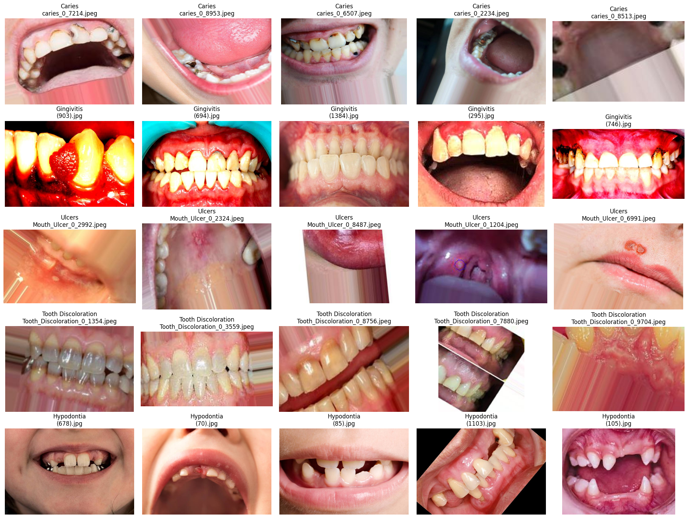
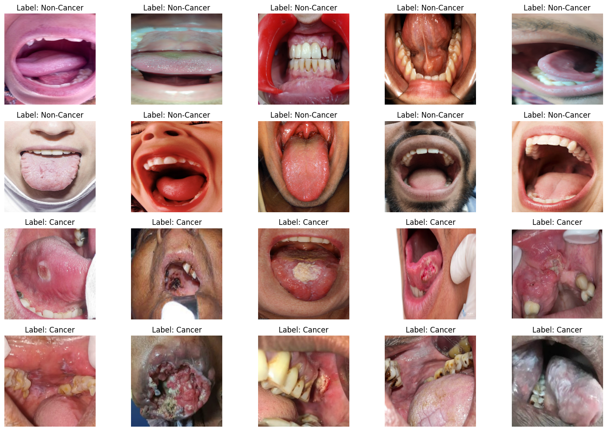

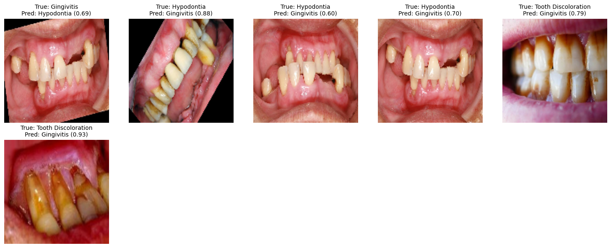
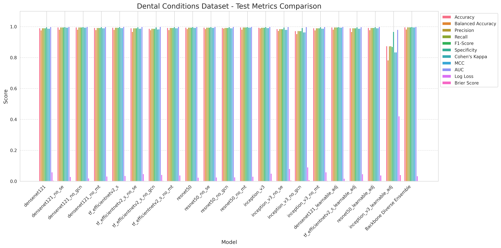
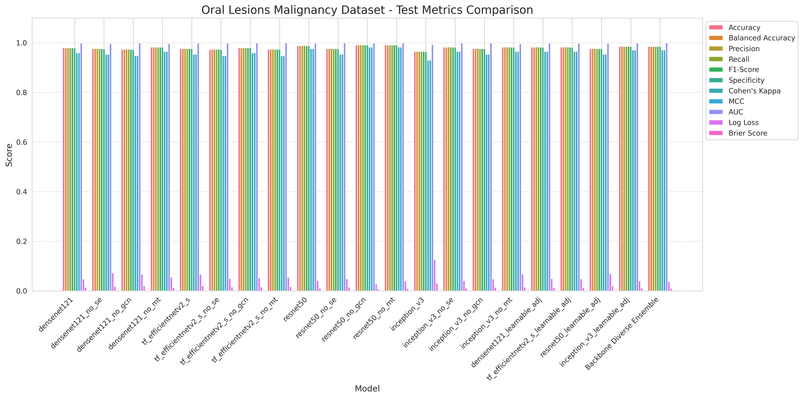


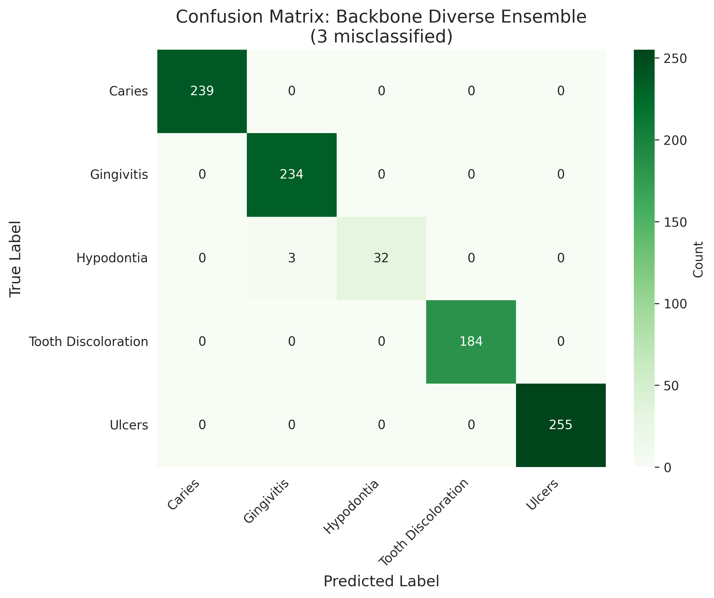
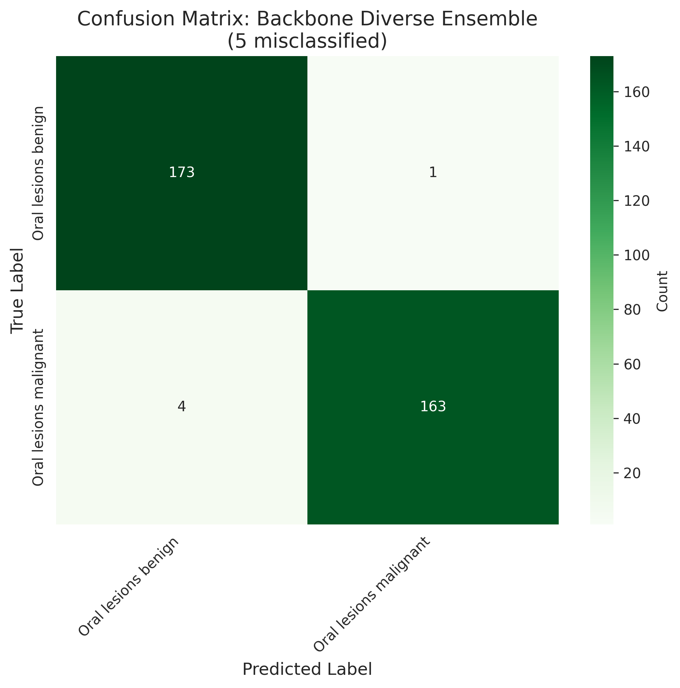
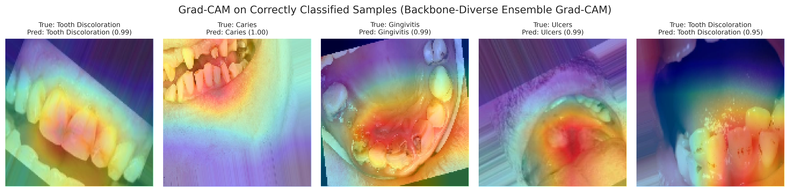
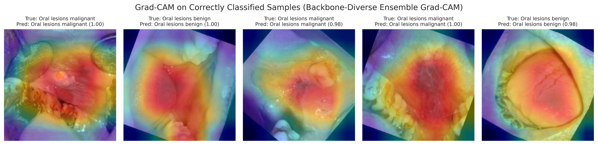
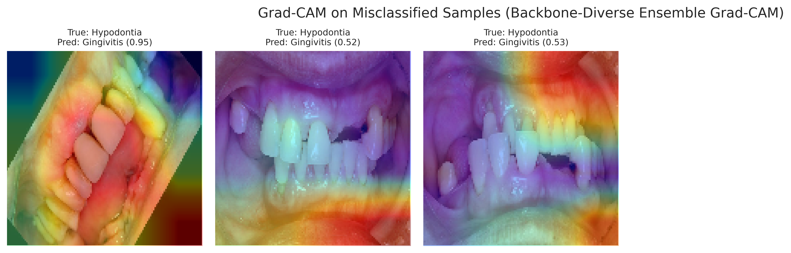
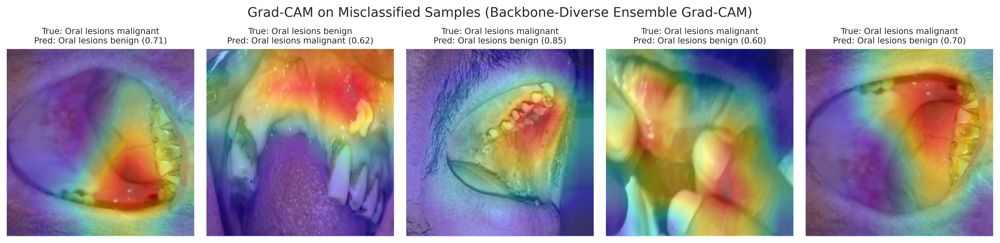


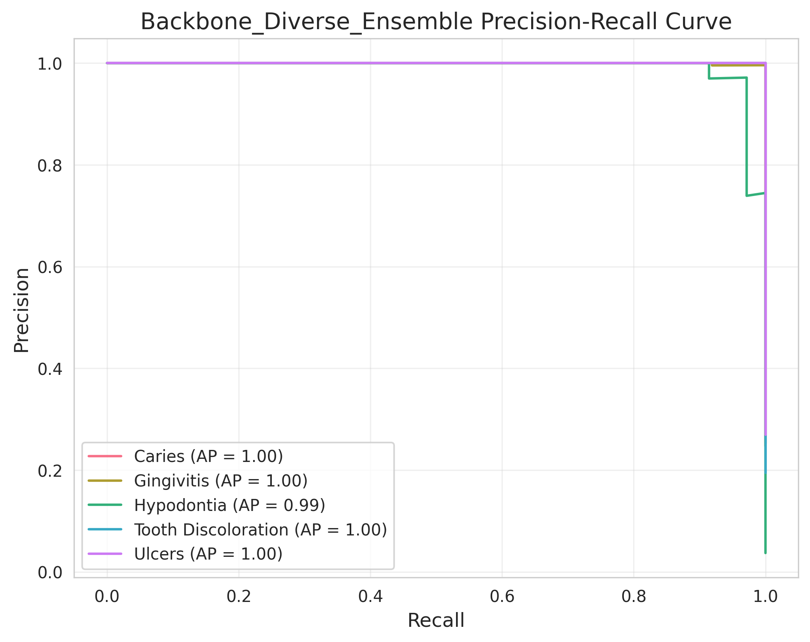
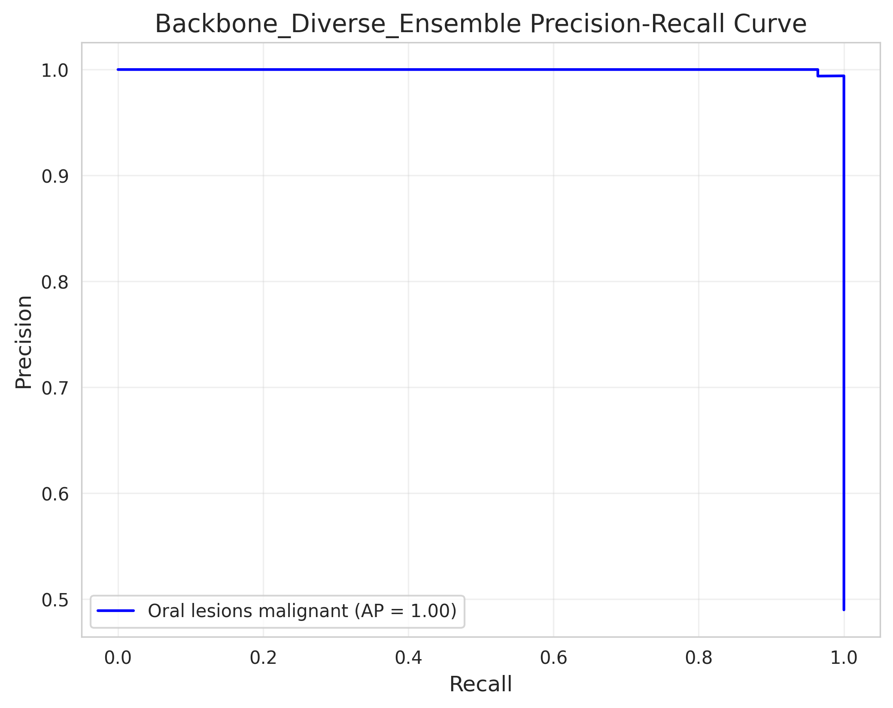

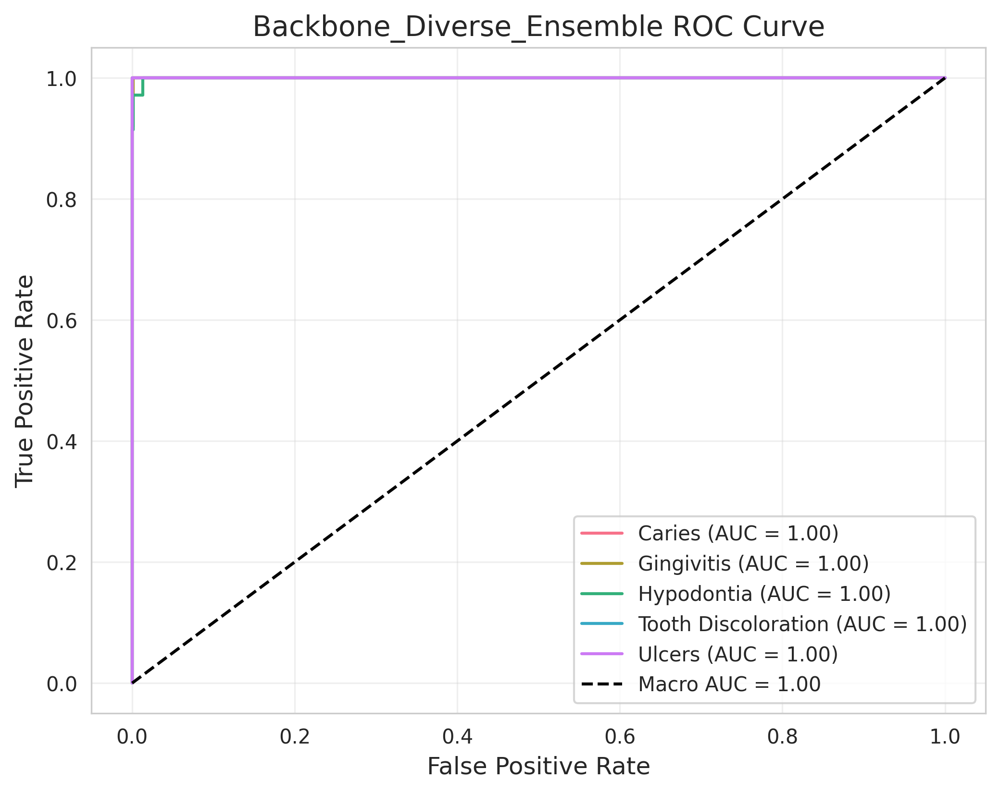
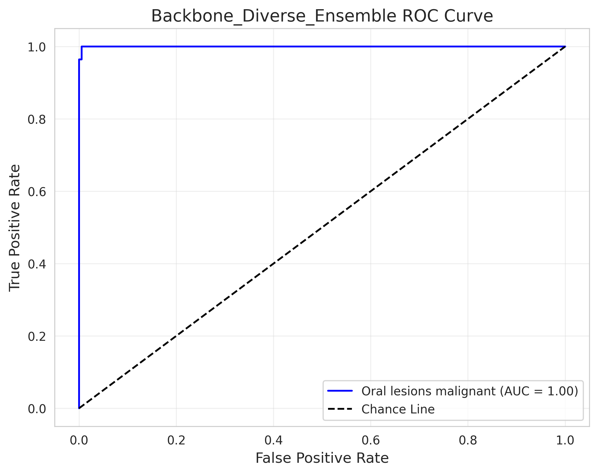
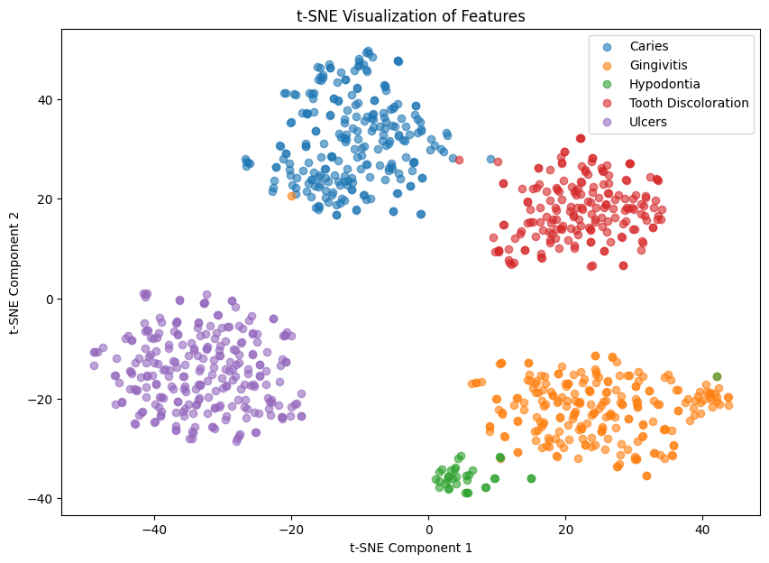
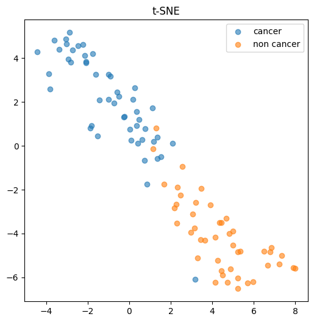

# Conclusions

In this work, we have presented MultiDentNet, a novel self-attention-enhanced DenseNet architecture designed for the simultaneous classification of five common dental conditions (caries, gingivitis, tooth discoloration, ulcers, and Hypodontia) as well as oral cancer from intraoral images. Our key findings include:

## Key Findings

- **High diagnostic performance:** On a held-out test set of 947 images for dental conditions, our model achieved 99.37% overall accuracy, 99.37% precision and recall, a macro-F1 score of 0.98, and a macro-AUC of 1.00. For oral cancer, the model achieved 94.68% accuracy, 97.62% precision, 91.11% recall, and an F1-score of 0.94 on a dataset of 131 images. These results demonstrate robust classification even for underrepresented classes, such as Hypodontia (F1 = 0.94) and oral cancer (F1 = 0.95 for Cancer class).

- **Effective imbalance handling:** By integrating Focal Loss and a domain-specific augmentation pipeline (including CLAHE, elastic deformations, and anisotropic rotations), we substantially mitigated the effects of severe class skew, ensuring strong performance across all conditions.

- **Enhanced interpretability:** Qualitative analyses such as t-SNE feature clustering, one-vs-rest ROC/PR curves, and confusion-matrix visualizations confirmed clear class separability and provided valuable insights into residual error modes, fostering transparency and clinician trust.

These results directly address our original objective of developing a unified, scalable diagnostic tool for comprehensive oral health assessment. By combining hierarchical self-attention with DenseNet's feature reuse, our framework effectively captures both fine-grained lesion details and global contextual cues, addressing limitations in prior studies that focused on single or dual conditions.

## Implications

Our approach offers several practical benefits for clinical practice:

- *Clinical decision support:* The high accuracy, confidence, and interpretability of MultiDentNet make it a promising candidate for real-time augmentation of dentist evaluations, potentially reducing diagnostic errors and enhancing patient outcomes.

- *Workflow efficiency:* An end-to-end system that concurrently screens for multiple dental conditions and oral cancer can streamline clinical workflows, reduce patient chair time, and minimize variability across clinicians.

- *Foundation for multimodal extension:* The self-attention modules and training strategies we propose can be readily adapted to incorporate additional imaging modalities, such as radiographs or 3D scans, further enhancing diagnostic capabilities.

## Limitations

While MultiDentNet demonstrates exceptional performance on the current datasets, several limitations warrant consideration:

- **Dataset diversity:** The dental condition images were sourced from a limited number of clinical centers, and the oral cancer dataset is relatively small (131 images). External validation on more diverse populations, imaging devices, and larger datasets is needed to confirm generalizability.

- **Two-dimensional images:** Intraoral photographs may not capture sub-surface pathology visible in radiographs. Future work should explore multimodal fusion to integrate radiographic data for a more comprehensive diagnostic tool.

- **Threshold optimization:** Although AUC values indicate excellent ranking capability, optimal decision thresholds for each class remain to be calibrated for specific clinical settings to maximize clinical utility.

## Future Work

Building on these findings, we plan to:

- Validate MultiDentNet on multi-institutional and mobile-device-captured image datasets to assess its robustness in tele-dentistry contexts and ensure applicability across diverse populations.

- Integrate radiographic inputs (e.g., bitewing X-rays, CBCT) via a multimodal architecture to improve the detection of sub-surface lesions and enhance diagnostic accuracy.

- Investigate active-learning strategies to reduce annotation burden and continually adapt the model to evolving clinical practices, ensuring long-term relevance and performance.

## Summary

MultiDentNet provides a comprehensive, interpretable, and high-performance solution for multi-condition dental and oral cancer diagnostics. By addressing the limitations of prior research and offering a scalable framework for clinical deployment, we believe this work will catalyze further advancements in AI-driven oral healthcare and accelerate the adoption of intelligent diagnostic tools in everyday practice.
